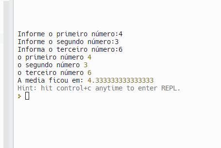

# Prática da Semana 1
  
Elabore um algoritmo que receba três números e ao final imprima na tela, a soma dos três números e a média dos três números.

  ## Exemplo de execução do programa
  
  
 

 
## Índice

- Desafio
- Links
- Tecnologias usadas
- O que eu aprendi
- Recursos úteis
- Desafio

## Links usados:

- https://developer.mozilla.org/pt-BR/docs/Web/JavaScript
- https://youtu.be/ekTEVutshXk?si=Q0M7EEK5V9ETv-np
- https://www.npmjs.com/

## Tecnologias usadas:
- javaScript 

 ## Objetivos de aprendizagem
  1. Declarar variáveis
  2. Utilizar operadores
  3. Utilizar comandos de entrada e saída de dados
  ## Instituto Federal do Espírito Santo

